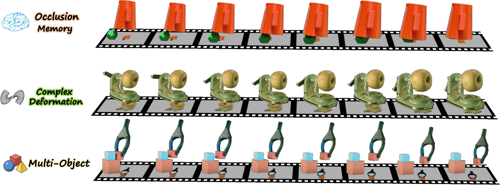
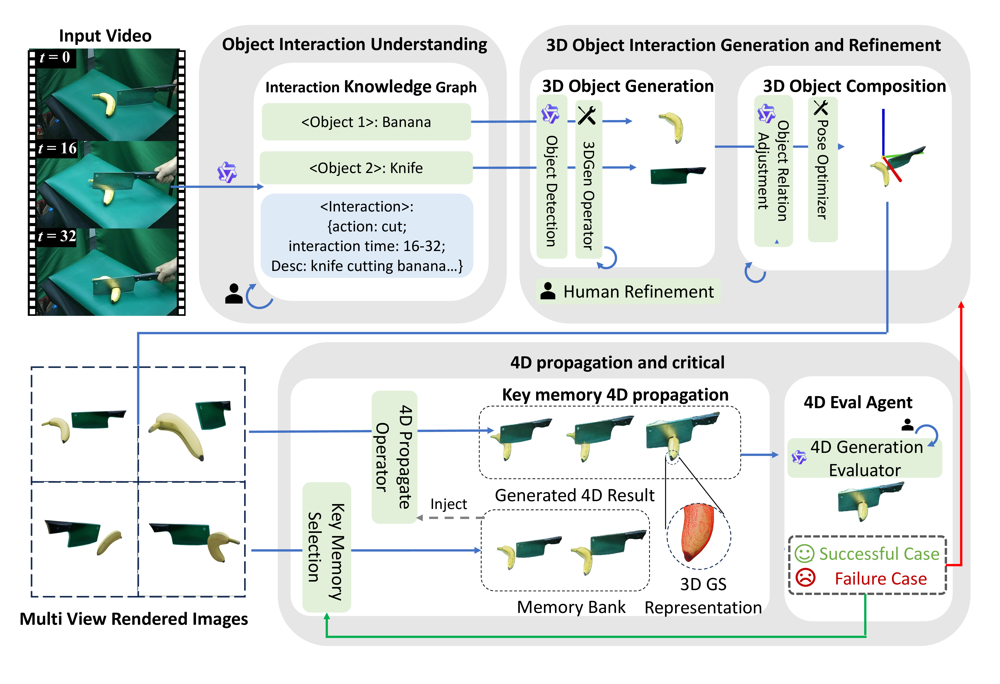

<div align="center">

# HAT-4D

### Lifting Monocular Video for 4D Multi-Object Interactions via Human-Agent Collaboration

**ECCV 2026**

[](https://arxiv.org/pdf/2606.28215) [](https://lijiaxin0111.github.io/HAT4D/) [](https://huggingface.co/datasets/Lijiaxin0111/MVOIK-4D) [](https://www.python.org/) [](https://pytorch.org/) [](LICENSE)

</div>

<p align="center">
  
</p>

## News 🔥

- **2026-06-30**: The **MVOIK-4D** dataset has been released on [Hugging Face](https://huggingface.co/datasets/Lijiaxin0111/MVOIK-4D).
- **2026-06-26**: HAT-4D is accepted to **ECCV 2026**.

## Overview ✨

HAT-4D is an agentic framework for reconstructing 3D geometry, temporal dynamics, and physical interactions of multiple objects from a single monocular video. The project targets dynamic, in-the-wild object interactions where severe occlusion, depth ambiguity, and complex motion make conventional monocular 4D reconstruction difficult.

By integrating vision-language models with a multi-level human-in-the-loop feedback mechanism, HAT-4D resolves interaction-induced ambiguities during 3D generation and 4D propagation. The framework further serves as a scalable data engine for **MVOIK-4D**, an open-world benchmark for monocular 4D interaction reconstruction with evaluation focused on physical plausibility and temporal consistency.

## Method 🧠

<p align="center">
  
</p>

HAT-4D decomposes monocular interaction lifting into agent-assisted perception, human feedback, 3D asset generation, and temporally consistent 4D propagation. This design enables the system to recover physically plausible multi-object interactions without relying on expensive multi-camera capture setups.


## ToDo List ✅

- [x] Open-source MVOIK-4D .
- [ ] Open-source HAT-4D toolkit.

## Citation 📝

If you find this project useful for your research, please cite:

```bibtex
@inproceedings{Li2026hat4d,
  title     = {HAT-4D: Lifting Monocular Video for 4D Multi-Object Interactions via Human-Agent Collaboration},
  author    = {Li, Jiaxin and Author, Second and Author, Third},
  booktitle = {Computer Vision -- ECCV 2026},
  year      = {2026},
  note      = {Accepted, to appear}
}
```

## References 🙏

We thank the following projects and systems for making this work possible:

- [SAM3D](https://github.com/facebookresearch/sam3d)
- [Qwen-VL](https://github.com/QwenLM/Qwen-VL)
- [viser](https://github.com/nerfstudio-project/viser)

## License 📄

This repository is released under the [Apache License 2.0](LICENSE).

Unless required by applicable law or agreed to in writing, software distributed under this license is distributed on an "AS IS" BASIS, WITHOUT WARRANTIES OR CONDITIONS OF ANY KIND, either express or implied. See the [LICENSE](LICENSE) file for the full license text.
